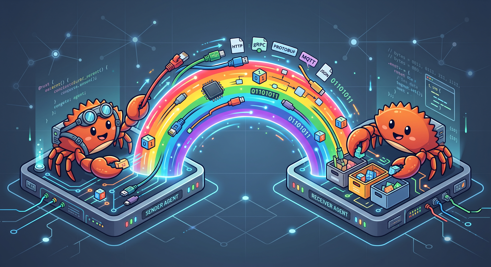
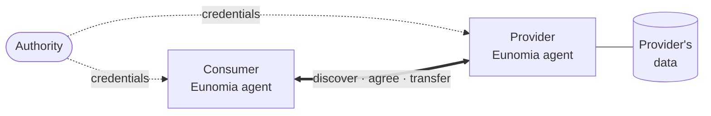
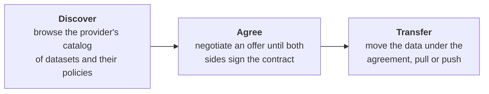
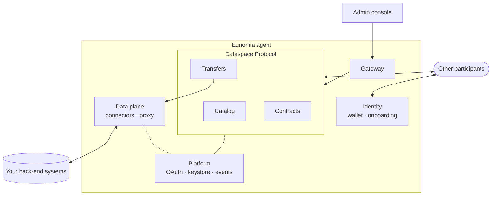

# Eunomia DS-Agent

[](https://eclipse-dataspace-protocol-base.github.io/DataspaceProtocol/2025-1/)
[](https://github.com/eclipse-dataspacetck/dsp-tck)
[](LICENSE.md)
[](https://hub.docker.com/r/rmenendez8/eunomia)
[](https://github.com/EunomiaUPM/rainbow/actions/workflows/build-containers.yaml)
[](https://github.com/EunomiaUPM/rainbow/actions/workflows/deploy-docs.yaml)

[](https://www.rust-lang.org)
[](https://tokio.rs)
[](https://github.com/tokio-rs/axum)
[](https://grpc.io)
[](https://www.postgresql.org)
[](https://redis.io)
[](https://www.vaultproject.io)
[](https://opentelemetry.io)
[](https://react.dev)

**Share data on your own terms.** Eunomia is a Dataspace Protocol agent written in Rust. With
it, an organisation joins a dataspace and publishes what it offers, agrees on how it may be
used, and delivers it to the partners it trusts. Identity is built on verifiable credentials,
not on a central account.

One agent covers both sides of an exchange. As a **provider** it publishes a catalog and
enforces the terms it agreed. As a **consumer** it finds datasets in other catalogs,
negotiates contracts for them and receives the data.

Eunomia implements [Dataspace Protocol 2025-1](https://eclipse-dataspace-protocol-base.github.io/DataspaceProtocol/2025-1/)
and is checked against the Eclipse [DSP TCK](https://github.com/eclipse-dataspacetck/dsp-tck).
It is developed by the GING research group (Next Generation Internet Group) at the
Departamento de Ingeniería de Sistemas Telemáticos, Universidad Politécnica de Madrid.




## The dataspace at a glance

Every participant runs its own agent and keeps its data at home. Agents trust each other
because an authority vouches for them, and they exchange data only under a signed agreement.



## From discovery to delivery

A data exchange always follows the same three steps, each one a part of the Dataspace Protocol.



Before any of this, the two agents **onboard**. Each one presents the credentials its authority
issued, and from then on the agents recognise each other on every call.

## What you get

- **A complete DSP agent.** Catalog, contract negotiation and transfer process, on both the
  provider and the consumer side, behind the endpoints the protocol defines.
- **Self-sovereign identity.** A wallet and a DID per agent. Peers onboard over GNAP and
  OID4VP, and credentials are obtained over OID4VCI. Optional Gaia-X self-attestation.
- **Catalogs that mean something.** DCAT 3 datasets, distributions and data services, with
  ODRL offers attached. Reusable policy templates turn into concrete offers in one call.
- **Connect your back ends.** Connector templates describe how to reach an HTTP system, pull
  or push, with basic, bearer, API key or OAuth 2.0 credentials. Partners never see the back
  end: the data plane relays the data through its own proxy and adds the credentials itself.
- **Secrets kept secret.** A versioned keystore for parameters and secrets, backed by Vault.
- **Multi-tenant by design.** One deployment serves many organisations, each isolated in its
  own tenant, with role-based access for its users.
- **Built-in OAuth server.** Users, clients, personal access tokens, and every common grant,
  PKCE included. Services authenticate to each other with client credentials.
- **Live events.** Every change is published on an event bus. Follow it in the browser through
  server-sent events, or subscribe signed webhooks with retries and a dead letter queue.
- **Admin console.** A web UI to run all of the above, served by the agent itself.
- **Observable.** OpenTelemetry traces and metrics, with a ready-made Jaeger, Prometheus and
  Grafana stack.
- **One binary or many services.** Run everything in a single process, or split it into one
  service per agent. The same code composes both.

## Inside an agent



Each box is a crate of this workspace:

| Area | Crates |
|---|---|
| Dataspace Protocol | [`catalog-agent`](crates/catalog-agent), [`negotiation-agent`](crates/negotiation-agent), [`transfer-agent`](crates/transfer-agent) |
| Identity | [`auth`](crates/auth) |
| Data plane | [`dataplane`](crates/dataplane), [`connector`](crates/connector) |
| Platform | [`oauth`](crates/oauth), [`keystore`](crates/keystore), [`events`](crates/events) |
| Gateway and console | [`bff`](crates/bff), [`gui/`](gui) |
| Foundation | [`common`](crates/common): boot, composition, config, auth, RDF and DSP building blocks |
| All in one | [`monolith`](crates/monolith): every agent in one process, the `rmenendez8/eunomia` image |

Every crate has its own README with its structure, API and tests.

## Getting started

### Requirements

- Rust (stable) and [Task](https://taskfile.dev)
- Docker with compose
- Node.js, only to work on the admin console
- [`ymir`](https://github.com/EunomiaUPM/ymir) checked out next to this repository
  (`../ymir`), since the workspace depends on it by path

### Try it with the published images

The mini stacks start a database, Redis, a wallet and the agent for one participant:

```bash
task deployment:mini:provider   # provider on http://localhost:1200
task deployment:mini:consumer   # consumer on http://localhost:1100
```

With both running and an authority listening on `:1500`, onboard the consumer with the provider:

```bash
task env:onboard:mini
```

### Run from source

The dev scripts start the infrastructure in Docker, the admin console with Vite and the agent
with `cargo watch`:

```bash
task deployment:dev:provider
task deployment:dev:consumer
task env:onboard:dev
```

Every agent binary has two commands, both driven by a YAML config under
`static/environment/config`. Paths inside the dev configs are relative to `crates/monolith`,
so run them from there:

```bash
cd crates/monolith
cargo run setup -e ../../static/environment/config/dev/dev.provider.yaml   # vault secrets and migrations
cargo run start -e ../../static/environment/config/dev/dev.provider.yaml   # seed, then serve
```

### Seed data

```bash
task env:populate              # catalogs, contracts and transfers
task env:populate:mates        # known agents and authorities
```

## Observability

Agents export traces and metrics over OTLP when `OTEL_EXPORTER_OTLP_ENDPOINT` is set. A local
stack with an OpenTelemetry collector, Jaeger (`:16686`), Prometheus (`:9090`) and Grafana
(`:3000`) is in `deployment/dev/docker-compose.observability.yaml`.

## Conformance

`scripts/run-tck.sh` seeds the agents and runs the Eclipse DSP TCK (`1.0.0-RC6`) against them,
using the fixtures in `tck/` and `static/dsp_tck`.

## Tests

```bash
cargo test --workspace          # every crate, no infrastructure needed
task test:integration           # DSP flows between two agents, on Postgres and Redis
task test:onboarding            # SSI onboarding against the running dev stack
```

Each crate keeps its tests in `tests/`, one folder per layer. Integration tests live in
`crates/monolith/tests/`.

## Repository layout

```text
crates/         Rust workspace
gui/            Admin console (React)
deployment/     Dockerfile and docker compose stacks (mini, dev, prod, observability)
scripts/        Onboarding, data seeding and TCK runner; entry points are in Taskfile.yml
static/         Runtime config, vault fixtures, JSON-LD specs, connector blueprints, TCK fixtures
tck/            DSP TCK properties and mapping
docs/           Documentation site (Fumadocs)
```

## Contributing

Contributions are welcome. [CONTRIBUTING.md](CONTRIBUTING.md) explains the workflow, how the
code is organised, the code and test conventions, and what a pull request needs.

## License

GPL-3.0. See [LICENSE.md](LICENSE.md).
