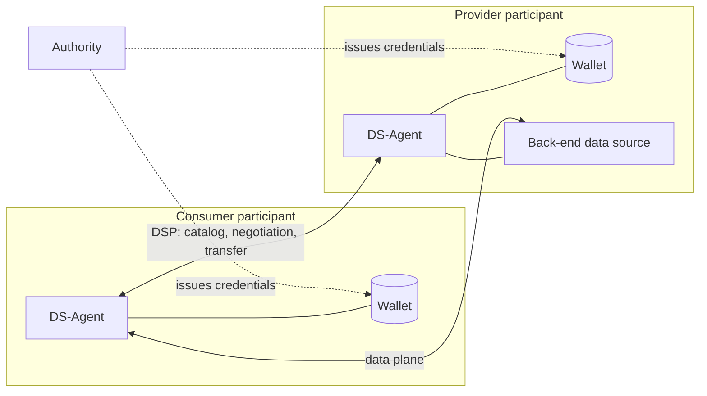
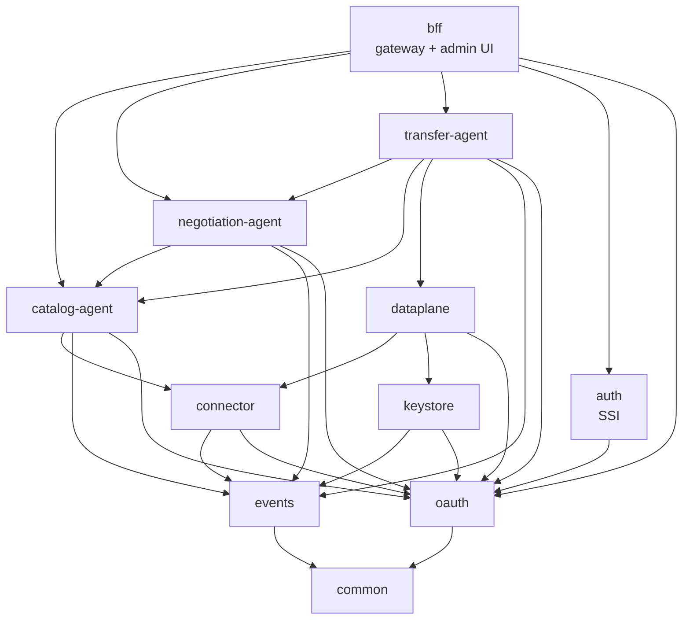

# Eunomia DS-Agent

A Dataspace Protocol agent written in Rust. It lets an organisation join a dataspace as a
provider, a consumer or both: publish a catalog, negotiate contracts over it and transfer data
under the agreed policies, with identity based on verifiable credentials.

The agent implements [Dataspace Protocol 2025-1](https://eclipse-dataspace-protocol-base.github.io/DataspaceProtocol/2025-1/)
(catalog, contract negotiation and transfer process) and is checked against the Eclipse
[DSP TCK](https://github.com/eclipse-dataspacetck/dsp-tck). It is developed by the GING research
group (Next Generation Internet Group) at the Departamento de Ingeniería de Sistemas Telemáticos,
Universidad Politécnica de Madrid.

## How a dataspace looks from here

Each participant runs its own agent. Agents talk to each other through the DSP endpoints and
to their own wallet and back-end systems through private APIs. An authority issues the
credentials that participants present to each other during onboarding.



Inside a participant, the agent is split into crates that can run together in one process
(`monolith`) or as separate services. The same composition code wires both: when two modules
live in the same process they call each other directly, otherwise through HTTP facades.



## Crates

| Crate | Kind | What it does |
|---|---|---|
| [`common`](crates/common) | lib | Shared foundation: boot and module composition, config, errors, auth extractors, pagination, RDF/JSON-LD, DSP types, gRPC helpers, telemetry |
| [`catalog-agent`](crates/catalog-agent) | bin + lib | DCAT 3 catalog, datasets, distributions, data services and ODRL policies. DSP catalog protocol |
| [`negotiation-agent`](crates/negotiation-agent) | bin + lib | Contract negotiation state machine, offers and agreements. DSP contract negotiation protocol |
| [`transfer-agent`](crates/transfer-agent) | bin + lib | Transfer process control plane. DSP transfer process protocol |
| [`dataplane`](crates/dataplane) | lib | Data plane that moves the data once a transfer starts |
| [`connector`](crates/connector) | lib | Connector templates and instances that describe how to reach a back-end system. Design in [`DESIGN.md`](crates/connector/DESIGN.md) |
| [`auth`](crates/auth) | bin + lib | SSI authentication: wallet integration, onboarding, verifiable presentations between participants |
| [`oauth`](crates/oauth) | lib | OAuth 2.1 authorization server: clients, client credentials, PKCE, personal access tokens |
| [`keystore`](crates/keystore) | lib | Secrets and parameters used by connectors and services |
| [`events`](crates/events) | lib | Event bus with in-process broadcast, outbox persistence and signed webhooks |
| [`bff`](crates/bff) | bin + lib | Gateway for the admin UI: reverse proxy to the other agents, perimeter auth, event streams over WebSocket and SSE |
| [`monolith`](crates/monolith) | bin | Runs every module in one process. This is the `eunomia` Docker image |

Service and domain crates follow the same hexagonal layout (`entities`, `services`, `data`,
`http`, `setup`), described in [`CLAUDE.md`](CLAUDE.md).

## Repository layout

```text
crates/         Rust workspace
gui/            React admin UI (served by bff in production)
deployment/     Dockerfile and docker compose stacks (mini, dev, prod, observability)
scripts/        Onboarding, data seeding and TCK runner; entry points are in Taskfile.yml
static/         Runtime config, vault fixtures, JSON-LD specs, connector blueprints, TCK fixtures
tck/            DSP TCK properties and mapping
docs/           Documentation site (Fumadocs)
```

## Getting started

### Requirements

- Rust (stable) and [Task](https://taskfile.dev)
- Docker with compose
- Node.js, only to work on the admin UI
- [`ymir`](https://github.com/EunomiaUPM/ymir) checked out next to this repository (`../ymir`), since the workspace depends on it by path

### Try it with the published images

The mini stacks start a database, Redis, a wallet and the agent for one participant:

```bash
task deployment:mini:provider   # provider on http://localhost:1200
task deployment:mini:consumer   # consumer on http://localhost:1100
```

With both running and an authority listening on `:1500`, onboard the consumer into the provider:

```bash
task env:onboard:mini
```

### Run from source

`deployment/dev` scripts start the infrastructure in Docker, the admin UI with Vite and the
agent with `cargo watch`:

```bash
task deployment:dev:provider
task deployment:dev:consumer
task env:onboard:dev
```

The agent binary has two commands, both driven by a YAML config under `static/environment/config`.
Paths inside the dev configs are relative to `crates/monolith`, so run them from there:

```bash
cd crates/monolith
cargo run setup -e ../../static/environment/config/dev/dev.provider.yaml   # migrations and seeders
cargo run start -e ../../static/environment/config/dev/dev.provider.yaml   # serve
```

### Seed data

```bash
task env:populate              # catalogs, contracts and transfers
task env:populate:mates        # known agents and authorities
```

## Observability

Agents export traces and metrics over OTLP when `OTEL_EXPORTER_OTLP_ENDPOINT` is set. A local
stack with an OpenTelemetry collector, Jaeger (`:16686`), Prometheus (`:9090`) and Grafana
(`:3000`) is in `deployment/dev/docker-compose.observability.yaml`.

## Conformance

`scripts/run-tck.sh` seeds the agents and runs the Eclipse DSP TCK (`1.0.0-RC6`) against them,
using the fixtures in `tck/` and `static/dsp_tck`.

## Tests

```bash
cargo test --workspace
```

Each crate keeps its tests in its own `tests/` directory, named after the module under test.

## Contributing

Work on a branch and open a pull request against `main`. Code conventions (layering, no free
functions, comments, protocol references) are in [`CLAUDE.md`](CLAUDE.md).

## License

GPL-3.0. See [LICENSE.md](LICENSE.md).
