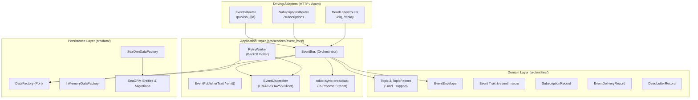

# Event Bus & External Webhook Dispatcher (`events`)

[](https://www.gnu.org/licenses/gpl-3.0)
[](https://www.rust-lang.org/)
[](#architecture-overview)

The **`events`** crate provides a high-throughput, resilient **hybrid Pub/Sub event bus** designed for both internal in-process broadcast messaging and reliable external webhook delivery across the DS-Protocol ecosystem.

Built according to Clean / Hexagonal Architecture (Ports & Adapters) specified in [`CLAUDE.md`](../../CLAUDE.md), it features **transactional outbox persistence**, sub-millisecond local broadcasting, **HMAC-SHA256 payload signing**, **exponential backoff with full jitter**, and a **Dead Letter Queue (DLQ)** with manual and batch re-drive capabilities.

---

## Table of Contents

- [Architecture Overview](#architecture-overview)
- [Component Structure](#component-structure)
- [Cross-Crate Event Integration](#cross-crate-event-integration)
  - [1. The `Event` Trait & `event!` Macro](#1-the-event-trait--event-macro)
  - [2. Topic Naming & Wildcard Subscriptions (`transfers:bla`, `transfers:*`)](#2-topic-naming--wildcard-subscriptions-transfersbla-transfers)
  - [3. Publishing Events from Other Crates](#3-publishing-events-from-other-crates)
  - [4. In-Process Consumption (Typed Deserialization)](#4-in-process-consumption-typed-deserialization)
  - [5. External Webhook Delivery & HMAC Verification](#5-external-webhook-delivery--hmac-verification)
- [Reliability & Resilience Engine](#reliability--resilience-engine)
  - [Exponential Backoff with Full Jitter](#exponential-backoff-with-full-jitter)
  - [Failure Classification](#failure-classification)
  - [Dead Letter Queue (DLQ) & Re-Drive](#dead-letter-queue-dlq--re-drive)
- [Setup & Lifecycle Management](#setup--lifecycle-management)
- [REST API Reference](#rest-api-reference)
- [Testing Guide](#testing-guide)

---

## Architecture Overview

Following Clean / Hexagonal Architecture, the crate decouples domain logic, application use cases, persistence adapters, and transport drivers:



---

## Component Structure

```text
crates/events/
├── Cargo.toml
├── README.md
├── tests/
│   ├── bus_tests.rs                 # Integration test suite (HTTP, DLQ, Webhooks, Retry)
│   └── event_macro_tests.rs         # Cross-crate event trait, macro, and wildcard tests
└── src/
    ├── lib.rs                       # Root exports and backward-compatibility aliases
    ├── entities/                    # Domain Layer: Pure domain entities & commands
    │   ├── mod.rs                   # Re-exports all domain types
    │   ├── topic.rs                 # Topic and TopicPattern (supports : and .)
    │   ├── envelope.rs              # EventEnvelope
    │   ├── subscription.rs          # SubscriptionRecord, DeliveryStatus, DeadLetterStatus
    │   ├── delivery.rs              # EventDeliveryRecord
    │   ├── dead_letter.rs           # DeadLetterRecord
    │   ├── commands.rs              # CreateSubscriptionDto, UpdateSubscriptionDto, PublishEventRequest
    │   ├── queries.rs               # ListEventsQuery, ListDeadLettersQuery
    │   └── traits.rs                # Event trait, IntoEvent trait, and event! macro
    ├── services/                    # Application Layer: Orchestration & Use Cases
    │   ├── mod.rs
    │   └── event_bus/
    │       ├── mod.rs               # Ports: EventBusTrait, EventPublisherTrait
    │       ├── service.rs           # EventBus orchestrator
    │       ├── dispatcher.rs        # HTTP dispatcher with HMAC-SHA256 signing
    │       ├── policy.rs            # RetryPolicy with exponential backoff & full jitter
    │       ├── worker.rs            # Background retry worker
    │       └── views.rs             # View DTOs with assemble() mappings
    ├── data/                        # Persistence Layer (Hexagonal)
    │   ├── mod.rs
    │   ├── factory.rs               # DataFactory trait
    │   ├── repo/                    # Repository ports and dedicated error enums
    │   │   ├── mod.rs
    │   │   ├── event.rs             # EventStoreRepo trait
    │   │   ├── subscription.rs      # EventSubscriptionRepo trait
    │   │   ├── delivery.rs          # EventDeliveryRepo trait
    │   │   └── dead_letter.rs       # EventDeadLetterRepo trait
    │   ├── sea_orm/                 # Concrete SeaORM adapter
    │   │   ├── mod.rs
    │   │   ├── factory.rs           # SeaOrmDataFactory impl of DataFactory
    │   │   ├── migrations/          # Migration scripts & get_events_migrations()
    │   │   ├── orm/                 # SeaORM table entities (into_domain, from_domain)
    │   │   └── repos/               # SeaORM repository implementations & facade
    │   └── in_memory/               # In-memory adapter for deterministic testing
    │       ├── mod.rs
    │       ├── factory.rs           # InMemoryDataFactory
    │       └── repos.rs             # Thread-safe in-memory repository store
    ├── http/                        # Driving Adapter Layer: Axum HTTP routers
    │   ├── mod.rs                   # EventsHttpRouter builder
    │   ├── events/                  # EventsRouter (/events, /publish, /{id})
    │   ├── subscriptions/           # SubscriptionsRouter (/subscriptions)
    │   └── dlq/                     # DeadLetterRouter (/dlq)
    └── setup/                       # Ceremony Layer: DI wiring & Lifecycle
        ├── mod.rs
        ├── context.rs               # AppContext (build & in_memory)
        ├── composition.rs           # EventsModule (ServiceModuleTrait)
        └── workers.rs               # RetryWorkerHandle with cooperative shutdown
```

---

## Cross-Crate Event Integration

Other crates (e.g. `transfer-agent-ref`, `catalog-agent`, `negotiation-agent`, `dataplane`) can publish and subscribe to domain events with minimal boilerplate.

### 1. The `Event` Trait & `event!` Macro

Add `events` to your crate's `Cargo.toml`:

```toml
[dependencies]
events = { version = "0.4.0", path = "../events" }
serde = { workspace = true }
```

#### Form A: Define Event Inline
```rust
use events::event;
use serde::{Deserialize, Serialize};

event! {
    #[derive(Debug, Clone, Serialize, Deserialize)]
    pub struct TransferStartedEvent {
        pub transfer_id: String,
        pub consumer_pid: String,
        pub provider_pid: String,
        pub agreement_id: String,
    } => "transfers:bla", "transfer-agent"
}
```

#### Form B: Decorate an Existing Serializable Struct
```rust
use events::event;
use serde::{Deserialize, Serialize};

#[derive(Debug, Clone, Serialize, Deserialize)]
pub struct TransferCompletedEvent {
    pub transfer_id: String,
    pub bytes_transferred: u64,
}

// Arguments: Struct, "topic:name", "source_crate", [optional schema_version]
event!(TransferCompletedEvent, "transfers:completed", "transfer-agent");
```

---

### 2. Topic Naming & Wildcard Subscriptions (`transfers:bla`, `transfers:*`)

Topics identify event categories using hierarchical segments. Both colon (`:`) and dot (`.`) are supported interchangeably:

| Topic Pattern | Matches `transfers:bla` | Matches `transfers:completed` | Matches `transfers:bla:sub` | Matches `catalog:dataset` | Description |
|---|:---:|:---:|:---:|:---:|---|
| `transfers:bla` |  Yes |  No |  No |  No | Exact match |
| `transfers:*` |  Yes |  Yes |  No |  No | Matches any single segment under `transfers:` |
| `transfers:**` |  Yes |  Yes |  Yes |  No | Matches any depth under `transfers:` |
| `*` or `**` |  Yes |  Yes |  Yes |  Yes | Matches all events system-wide |
| `transfers.*` |  Yes |  Yes |  No |  No | Dot notation matches colon topics seamlessly |

---

### 3. Publishing Events from Other Crates

Inject `Arc<EventBus>` into your application context or domain service and publish directly:

```rust
use std::sync::Arc;
use events::EventBus;

pub struct TransferService {
    event_bus: Arc<EventBus>,
}

impl TransferService {
    pub async fn start_transfer(&self, id: String) -> Result<(), Box<dyn std::error::Error>> {
        let event = TransferStartedEvent {
            transfer_id: id,
            consumer_pid: "urn:uuid:consumer-001".into(),
            provider_pid: "urn:uuid:provider-002".into(),
            agreement_id: "agreement-xyz".into(),
        };

        // Publish typed domain event directly
        let published = self.event_bus.publish_event(event).await?;
        tracing::info!(event_id = %published.id, "Event published to bus");
        Ok(())
    }
}
```

---

### 4. In-Process Consumption (Typed Deserialization)

For local in-process modules (such as WebSockets, BFF, or real-time event aggregation):

```rust
use std::sync::Arc;
use events::EventBus;

pub fn start_local_listener(event_bus: Arc<EventBus>) {
    let mut rx = event_bus.subscribe();

    tokio::spawn(async move {
        while let Ok(envelope) = rx.recv().await {
            // Check topic pattern
            if envelope.topic.as_str() == "transfers:bla" {
                if let Ok(event) = serde_json::from_value::<TransferStartedEvent>(envelope.payload) {
                    tracing::info!(transfer_id = %event.transfer_id, "Handled transfer event in-memory");
                }
            }
        }
    });
}
```

---

### 5. External Webhook Delivery & HMAC Verification

Subscribers receive HTTP `POST` requests when matching events are published:

```rust
use events::entities::commands::CreateSubscriptionDto;

let sub_dto = CreateSubscriptionDto {
    callback_address: "https://partner.example.com/events/webhook".to_string(),
    topic_pattern: "transfers:*".to_string(), // Matches transfers:bla, transfers:completed, etc.
    secret: Some("shared-hmac-secret-key-32-chars".to_string()),
    headers: None,
    retry_limit: Some(5),
    expiration_time: None,
};

ctx.subscription_repo.create_subscription(sub_dto).await?;
```

#### Headers Sent to Webhooks:
- `Content-Type: application/json`
- `X-Event-Id: urn:uuid:f47ac10b-58cc-4372-a567-0e02b2c3d479`
- `X-Event-Topic: transfers:bla`
- `X-Event-Timestamp: 2026-09-12T10:15:30Z`
- `X-Correlation-Id: urn:uuid:...` *(if provided)*
- `X-Hub-Signature-256: sha256=a591a6d40bf420404a011733cfb7b190d62c65bf0bcda32b57b277d9ad9f146e`

---

## Reliability & Resilience Engine

### Exponential Backoff with Full Jitter

Deliveries are retried according to an exponential curve augmented with randomized jitter:

$$\text{base} = \min\left(\text{initial\_backoff} \times \text{multiplier}^{\text{attempt} - 1},\, \text{max\_backoff}\right)$$
$$\text{delay} = \max\left(\text{base} + \text{random}(-\text{jitter\_range},\, +\text{jitter\_range}),\, 1.0\text{s}\right)$$

```rust
use events::RetryPolicy;

let policy = RetryPolicy {
    max_attempts: 5,           // Up to 5 delivery attempts
    initial_backoff_secs: 2,   // First retry after ~2s
    max_backoff_secs: 3600,    // Cap delay at 1 hour
    multiplier: 2.0,           // 2s, 4s, 8s, 16s...
    jitter_factor: 0.2,        // ±20% randomized jitter
    timeout_secs: 10,          // Webhook request timeout
    poll_interval_secs: 5,     // Poller scan interval
};
```

### Failure Classification

| Scenario | HTTP Status Codes | Action |
|---|---|---|
| **Transient Errors** | `408 Request Timeout`, `429 Too Many Requests`, `500-599 Server Errors`, Network Errors | **Retry**: calculates `next_retry_at` using backoff schedule. |
| **Permanent Errors** | `400 Bad Request`, `401 Unauthorized`, `403 Forbidden`, `404 Not Found` | **No Retry**: immediately moved to Dead Letter Queue (`DeadLetter`). |
| **Exhausted Retries** | Any status after `attempts >= retry_limit` | **Route to DLQ**: marks delivery `DeadLetter` and writes to `dead_letter_queue`. |

### Dead Letter Queue (DLQ) & Re-Drive

When deliveries fail permanently or exhaust retry limits, they are stored in `dead_letter_queue`:

```rust
// Replay single dead letter
let delivery = event_bus.replay_dead_letter("urn:uuid:dlq-id-123").await?;

// Replay all unresolved dead letters in bulk
let replayed_count = event_bus.replay_all_dead_letters().await?;
```

---

## Setup & Lifecycle Management

### 1. `AppContext`
```rust
use events::setup::AppContext;
use events::RetryPolicy;

// Production with live SeaORM database:
let ctx = AppContext::build(db, Some(RetryPolicy::default()));

// Zero-database in-memory setup for unit / integration tests:
let test_ctx = AppContext::in_memory(None);
```

### 2. Background Retry Worker
```rust
let worker_handle = ctx.spawn_retry_worker();

// Graceful cooperative shutdown on SIGTERM / SIGINT:
worker_handle.stop().await;
```

### 3. Module Composition (`EventsModule`)
[`EventsModule`](src/setup/composition.rs) implements `common::module_loader::service_module::ServiceModuleTrait`:
- `name()`: Returns `"events"`
- `migrations()`: Returns SeaORM migrations
- `http()`: Mounts REST API under `/api/v1/events`

---

## REST API Reference

All routes are mounted under `/api/v1/events`:

### Events (`/events`)

| Method | Route | Description | Response Status |
|---|---|---|---|
| `POST` | `/publish` | Publish an event envelope into the bus | `201 Created` |
| `GET` | `/` | List published events (`?topic=...&limit=50&offset=0`) | `200 OK` |
| `GET` | `/{id}` | Get event by URN or UUID | `200 OK` / `400 Bad Request` / `404 Not Found` |
| `GET` | `/{id}/deliveries` | List delivery records for an event | `200 OK` |

### Subscriptions (`/subscriptions`)

| Method | Route | Description | Response Status |
|---|---|---|---|
| `POST` | `/` | Create a webhook subscription | `201 Created` |
| `GET` | `/` | List all registered subscriptions | `200 OK` |
| `GET` | `/{id}` | Get subscription details by ID | `200 OK` / `404 Not Found` |
| `PUT` | `/{id}` | Update subscription pattern, secret, or headers | `200 OK` |
| `DELETE`| `/{id}` | Delete subscription | `204 No Content` |

### Dead Letter Queue (`/dlq`)

| Method | Route | Description | Response Status |
|---|---|---|---|
| `GET` | `/` | List dead letters (`?status=Unresolved&limit=50`) | `200 OK` |
| `GET` | `/{id}` | Get dead letter details by ID | `200 OK` / `404 Not Found` |
| `POST` | `/{id}/replay` | Re-attempt delivery of a dead letter | `200 OK` |
| `POST` | `/replay-all` | Re-attempt all unresolved dead letters | `200 OK` (`{"replayed_count": n}`) |
| `DELETE`| `/{id}` | Purge dead letter entry permanently | `204 No Content` |

---

## Testing Guide

The crate provides zero-database in-memory implementations (`InMemoryEventBusRepo` and `InMemoryDataFactory`) enabling fast, deterministic tests:

```rust
#[tokio::test]
async fn test_domain_event_flow() {
    let ctx = events::setup::AppContext::in_memory(None);
    let mut rx = ctx.event_bus.subscribe();

    let event = TransferStartedEvent {
        transfer_id: "tx-1".into(),
        consumer_pid: "urn:uuid:c1".into(),
        provider_pid: "urn:uuid:p1".into(),
        agreement_id: "a1".into(),
    };

    ctx.event_bus.publish_event(event).await.unwrap();

    let received = rx.recv().await.unwrap();
    assert_eq!(received.topic.as_str(), "transfers:bla");
}
```

Run test suite:
```bash
cargo test -p events
```
